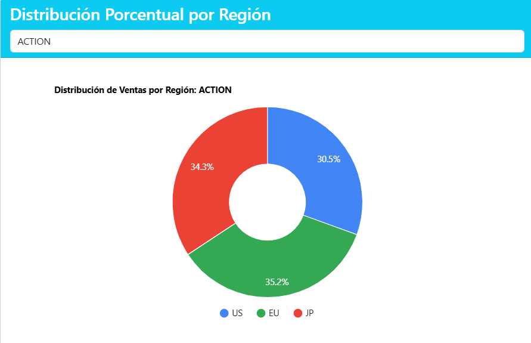

# Dashboard de Visualización de Datos - Juegos Android

Este proyecto es una aplicación web para visualizar y analizar datos de juegos Android, mostrando tendencias de ventas, instalaciones, categorías populares y distribución regional. El dashboard utiliza Google Charts para crear visualizaciones interactivas y dinámicas.

## Equipo de Desarrollo

* Leandro Muñoz
* Angelica Norato
* Giovanni Ortega

## Características

* **Visualizaciones Interactivas**: Gráficos dinámicos que permiten explorar los datos desde múltiples perspectivas
* **Análisis por Categoría**: Filtros por categorías de juegos para análisis detallado
* **Correlaciones**: Visualización de relaciones entre instalaciones, valoraciones y ventas
* **Diseño Responsive**: Adaptado para dispositivos móviles y de escritorio
* **Arquitectura Modular**: Código organizado siguiendo principios SOLID

## Visualizaciones Incluidas

1. **Top 10 Categorías de Juegos**: Muestra las categorías más populares por número de juegos
2. **Top Ventas por Categoría**: Presenta los juegos con mayores ventas en cada categoría
3. **Distribución Porcentual por Región**: Análisis de ventas por región (US, EU, JP) para categorías seleccionadas
4. **Instalaciones vs. Total Ratings**: Correlación entre número de instalaciones y valoraciones recibidas
5. **Top 10 Instalaciones por Categoría**: Juegos más instalados en cada categoría seleccionada
6. **Instalaciones vs Ventas Globales**: Análisis de la relación entre instalaciones y ventas

> Ejemplo
> 

## Tecnologías Utilizadas

* **Frontend**:
  * HTML5, CSS3, JavaScript
  * Bootstrap 5.3 para diseño responsive
  * Google Charts para visualizaciones
  * Papa Parse para procesamiento de CSV

* **Arquitectura**:
  * Patrón Módulo para encapsulamiento
  * Principios SOLID para mantenibilidad
  * Diseño orientado a componentes

## Estructura del Proyecto

```
proyecto-visualizacion/
├── index.html                   # Página principal que aloja todas las visualizaciones
├── css/
│   └── styles.css               # Estilos personalizados
├── js/
│   ├── data.js                  # Funciones para cargar y procesar datos
│   ├── charts.js                # Implementación de todos los gráficos
│   └── main.js                  # Inicialización y configuración
└── data/
    ├── android_games_clean.csv        # Dataset procesado
    ├── exploracion_datos_android_games.txt  # Documentación de exploración
    └── limpieza_datos_output.txt      # Documentación de limpieza
```

## Instalación y Uso

### Opción 1: Desde archivo ZIP

1. Descomprime el archivo ZIP en tu computadora.

### Opción 2: Desde GitHub

1. Clona este repositorio:

   ```bash
   git clone https://github.com/MLSLeandro-elit/DSS3-visualizacion-M3U4A1.git
   ```

2. Navega al directorio del proyecto:

   ```bash
   cd DSS3-visualizacion-M3U4A1
   ```

### Ejecutando el proyecto

Debido a restricciones de seguridad del navegador (CORS), es necesario servir los archivos a través de un servidor web local para que la aplicación funcione correctamente. No funcionará si simplemente abres el archivo index.html directamente.

Para ejecutar un servidor local simple, puedes usar uno de estos métodos:

#### Usando Python

```bash
# Si tienes Python 3
python -m http.server

# Si tienes Python 2
python -m SimpleHTTPServer
```

#### Usando Node.js

```bash
npx serve
```

#### Usando Visual Studio Code

1. Instala la extensión "Live Server"
2. Haz clic derecho en index.html
3. Selecciona "Open with Live Server"

Después, accede a la aplicación en tu navegador visitando: <http://localhost:8000> (el puerto puede variar).

## Origen de los Datos

Los datos utilizados en este dashboard provienen de un dataset limpio y procesado de juegos Android. El conjunto de datos incluye información sobre:

* Títulos de juegos
* Categorías
* Valoraciones de usuarios
* Instalaciones
* Ventas por región (US, EU, JP)
* Ventas globales
* Precios y modelo de monetización (gratuito/pago)

El proceso de limpieza y preparación de los datos está documentado en los archivos `limpieza_datos_output.txt` y `exploracion_datos_android_games.txt` incluidos en el directorio `data` del proyecto.

## Alternativas para Evitar Problemas CORS

Si continúas teniendo problemas con CORS, especialmente en Safari, puedes:

1. **Usar un navegador diferente**: Chrome y Firefox pueden ser más flexibles con archivos locales.

2. **Deshabilitar temporalmente restricciones de seguridad**:
   * En Chrome: Cierra todas las instancias de Chrome y ábrelo con el flag `--allow-file-access-from-files`
   * En Safari: Habilita el menú de desarrollo y deshabilita las restricciones de origen cruzado

3. **Alojar los datos en la nube**: Otra alternativa es alojar el archivo CSV en un servicio que proporcione encabezados CORS adecuados, como GitHub Gist o servicios similares.
